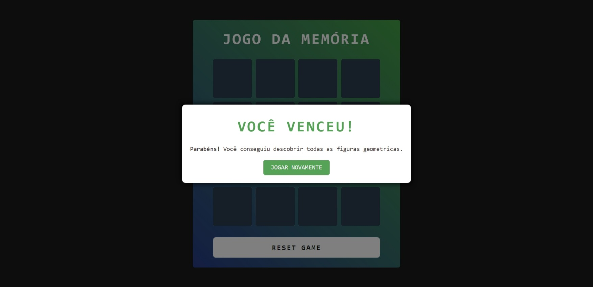

# Geometric Memory Game

## Descrição

O Jogo da Memória Geométrica é uma experiência simples, mas cativante, que desafia os jogadores a combinarem pares de figuras geométricas. O tabuleiro do jogo é composto por cartas, cada uma exibindo diferentes formas geométricas, como quadrados, círculos, triângulos, pirâmides e muito mais. O objetivo é encontrar todos os pares correspondentes, virando duas cartas por vez.

## Como Jogar

1. **Objetivo**: Combine todos os pares de figuras geométricas.
2. **Tabuleiro do Jogo**: Cartas com diversas figuras geométricas preenchem o tabuleiro do jogo.
3. **Jogabilidade**: Clique em duas cartas para revelar as figuras geométricas ocultas. Se as figuras coincidirem, as cartas permanecerão abertas; caso contrário, elas serão viradas novamente após um breve momento.
4. **Vitória**: Alcance a vitória combinando com sucesso todos os pares. Um modal de vitória aparecerá para celebrar sua conquista.

## Recursos

- Geração dinâmica de cartas com figuras geométricas aleatórias.
- Manipulação de cliques e lógica de correspondência.
- Modal de vitória exibido ao combinar com sucesso todos os pares.
- Efeitos sonoros para correspondências corretas e incorretas, bem como para a vitória.

## Modal

Um modal é utilizado para fornecer feedback ao jogador ao vencer o jogo. Ele exibe uma mensagem de parabéns junto com um botão para reiniciar a partida.

## Jogar

Clique [neste link](https://geometric-memory-game.vercel.app/) para participar, desafiar sua memória e relembrar das formas geométricas. Divirta-se!
